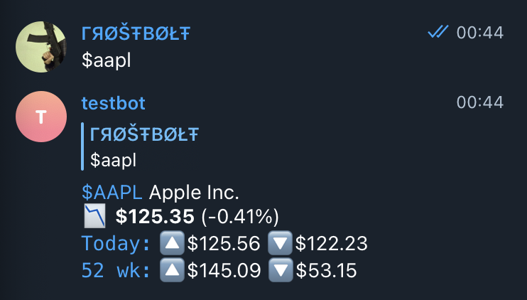

# go-stock-bot

Telegram bot that replies with a current stock price for the passed ticker.

The bot is meant to be added to trading-related group chats or channels. It can be accessed from private messages either.

## Live version [under construction]

This repository contains the source code of the @gostocksbot [available on Telegram](https://t.me/gostocksbot).

## Usage

Send the ticker with the leading `$` symbol to the chat with the bot. The bot will answer with some summary information on the mentioned stock.

